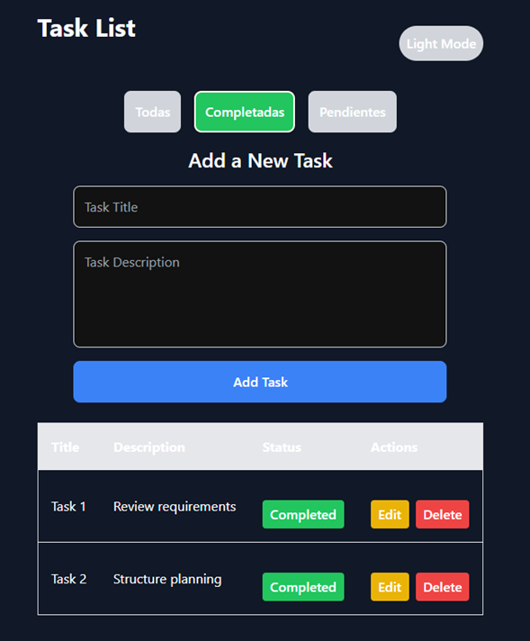
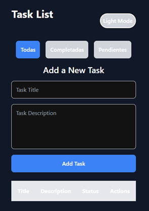
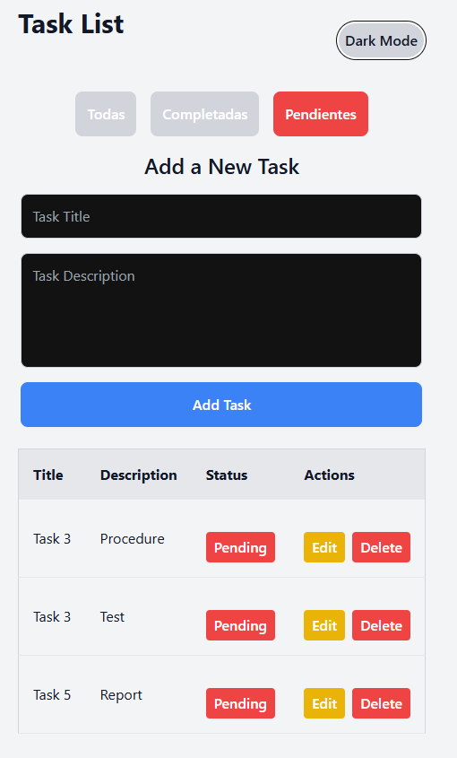
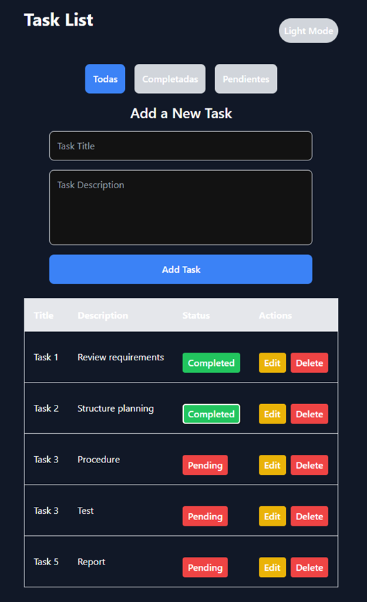

# TaskList Application

## 📋 Características
- Añadir nuevas tareas con título y descripción.
- Editar tareas existentes.
- Marcar tareas como completadas o pendientes.
- Eliminar tareas de la lista.
- Interfaz intuitiva y fácil de usar.

---

## 🖼️ Imágenes

### Imagen de tarea completada

### Imagen de tema oscuro

### Imagen de tarea pendiente

### Imagen de procedimiento

---

## 🚀 Tecnologías utilizadas

### Frontend:
- **React**: Framework para el desarrollo de interfaces de usuario.
- **TypeScript**: Para un desarrollo más robusto y seguro.
- **CSS/SCSS**: Para estilos personalizados.

### Backend:
- **Spring Boot**: Framework para el desarrollo del backend.
- **Java**: Lenguaje principal para la lógica de negocio.
- **MySQL**: Base de datos relacional.

---

## 🖥️ Configuración local

### Clonar el repositorio
git clone https://github.com/daniela20-m/App-TaskList.git

--

## 🖥️ Configurar el frontend

### 1. Navega a la carpeta del frontend:

cd task-list-frontend

### 2. Instala las dependencias:

npm install

### 3. Inicia el servidor local:

npm start

### 4. Accede a la aplicación en:

http://localhost:3000
